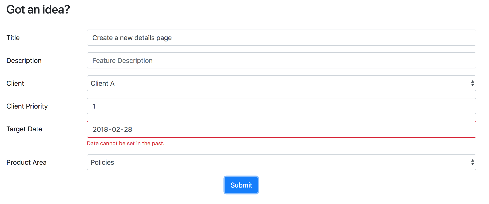

## Feature Request App
This is a project that I created as part of a coding challenge. The app allows a user to submit feature request and also shows a list of already submitted requests.

A "feature request" is a request for a new feature that will be added onto an existing piece of
software. The fields are:

* **Title**
* **Description**
* **Client:** A selection list of clients ("Client A", "Client B", "Client C")
* **Client Priority:** A numbered priority according to the client (1...n). Client Priority numbers
do not repeat for the given client, so if a priority is set on a new feature as "1", then all
other feature requests for that client are reordered.
* **Target Date**
* **Product Area:** A selection list of product areas (use 'Policies', 'Billing', 'Claims',
'Reports')

## Tech Stack
This project was built using the following technologies:

* Server Side Scripting: Python 3.5
* Server Framework: Flask
* ORM: Sql-Alchemy (MySQL)
* JavaScript: KnockoutJS
* Front-End: Bootstrap - The app is responsive and a11y-friendly.

## Getting Started

The app is hosted live at [Feature Request App Demo](http://featuredemoapp.us-west-1.elasticbeanstalk.com/) thanks to AWS Elastic Beanstalk and RDS, but if you want a local copy, continue reading.

These instructions will give you a local repository on your machine which you can then run and use. These steps assumes you have pip installed already.

```
git clone https://github.com/mariesta/FeatureRequestApp.git
pip install -r requirements.txt
python create_db.py
python application.py
```

Look for the line 'Running on [localhost url]'. If you navigate to this url, you should see this.


You can then add feature through this page:


This page also includes validation:


If all goes well, it populate the list page:


Have fun!

